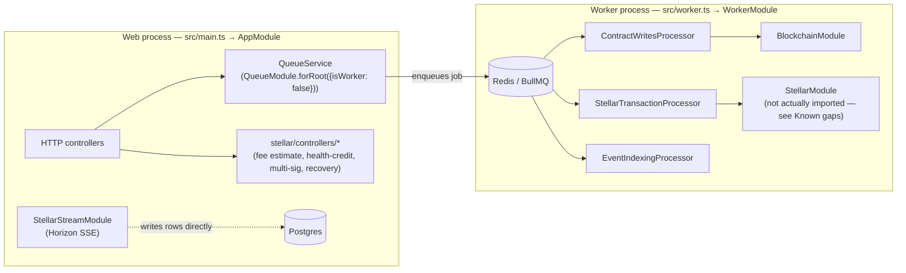
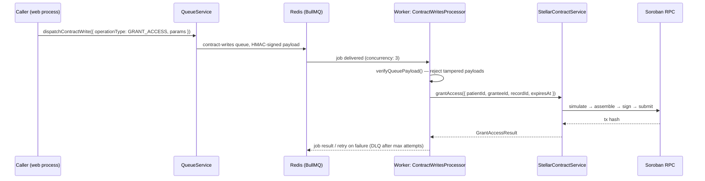
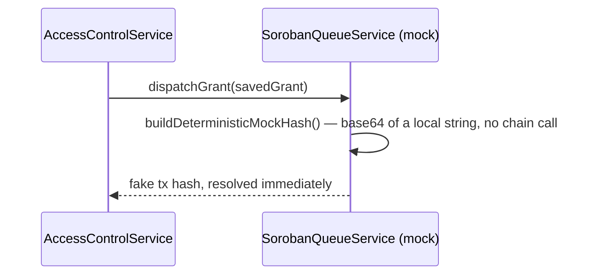

# Stellar / Soroban Integration Architecture

This document explains how the three Stellar-related directories —
`src/blockchain/`, `src/stellar/`, and `src/stellar-stream/` — fit together,
and how each interacts with the [background worker process](../README.md#background-worker-process)
(`src/worker.ts`). It also records the current, honest state of that
integration: several pieces described below are fully built and tested but
**not yet wired into the domain layer** (records, access-control) that the
rest of the application actually calls. Those gaps are called out explicitly
in [Known gaps](#known-gaps) rather than glossed over, since understanding
what's real versus scaffolded is exactly what's missing today (#787).

## Contents

- [The three directories, and why there are three](#the-three-directories-and-why-there-are-three)
- [Process split: web vs. worker](#process-split-web-vs-worker)
- [Request flow: a contract write, as built](#request-flow-a-contract-write-as-built)
- [Request flow: a contract write, as actually wired today](#request-flow-a-contract-write-as-actually-wired-today)
- [Event streaming](#event-streaming)
- [Fee estimation](#fee-estimation)
- [Multi-sig transactions](#multi-sig-transactions)
- [Known gaps](#known-gaps)

## The three directories, and why there are three

| Directory | Role | Process |
|---|---|---|
| `src/blockchain/` | Generated Soroban contract bindings (`generated/contract-types.ts`) plus one thin, typed wrapper service (`stellar-contract.service.ts`) that builds/signs/submits a transaction calling those bindings. Nothing else. | worker |
| `src/stellar/` | Everything else Stellar-related: a second, independent Horizon/Soroban client (`stellar.service.ts`), transaction retry/circuit-breaking, fee estimation, response caching, multi-sig transaction execution, a "health credit" contract client, and the HTTP controllers that expose read-only Stellar operations. | web (mostly) |
| `src/stellar-stream/` | A single service that opens a long-lived Horizon SSE connection and updates local `Record`/`AccessGrant` rows as on-chain transactions for the configured contract arrive. | web |

The split between `src/blockchain/` and `src/stellar/` is not a layering
convention — they are **two separate, independently-built clients** for
talking to Soroban, each with its own transaction-building, signing, and
polling logic:

- `src/blockchain/stellar-contract.service.ts` — `StellarContractService`.
  Consumed by `ContractWritesProcessor` (worker). Encodes calls using the
  generated bindings in `src/blockchain/generated/`, which are themselves
  regenerated from `scripts/contract-abi.json` by
  `scripts/generate-contract-types.js` (`npm run generate:contract-types`) —
  see that script's own header comment for the ABI-driven codegen flow.
- `src/stellar/services/stellar.service.ts` — `StellarService` (usually
  accessed through its circuit-breaker wrapper, `StellarWithBreakerService`).
  Consumed by `StellarTransactionProcessor` (worker) and by
  `src/stellar/controllers/*` (web). Builds the same `grant_access`/
  `verify_access`/`anchor_record` calls by hand with `nativeToScVal`, rather
  than through the generated bindings.

Both clients read `STELLAR_CONTRACT_ID` and sign with `STELLAR_SECRET_KEY`,
and both were the subject of the same class of bug independently: a
milliseconds-vs-seconds unit mismatch on `grant_access`/`verify_access`'s
`expires_at` had to be fixed in each client's own encode/decode logic
separately (commit `8c2392f`, "fix(stellar): resolve ms-vs-seconds unit
mismatch on grant/verify-access expiry"), because they don't share code. If
you're adding a new contract call, prefer extending
`StellarContractService`/the generated bindings — it's the newer, ABI-driven
path — rather than hand-encoding a third variant in `StellarService`.

## Process split: web vs. worker

This app runs as **two separate Node processes** from the same codebase,
bootstrapped from different entry files:

`QueueModule.forRoot({ isWorker })` (`src/queues/queue.module.ts`) is the
switch: `isWorker: false` (used by `AppModule`, i.e. the web process) only
registers `QueueService` so HTTP handlers can *enqueue* jobs; `isWorker: true`
(used by `WorkerModule`) additionally registers every `@Processor` class so
they actively pull jobs off Redis and execute them. **Only the worker process
ever calls into a Stellar client to submit a transaction** — the web process's
job is to validate, enqueue, and (separately) expose read-only Stellar
endpoints and the SSE stream ingester.

`StellarStreamModule` is the one exception to "Stellar work happens in the
worker": it's imported only into `AppModule` (web), not `WorkerModule`, so
event ingestion runs continuously alongside the HTTP server, not in the
worker. If the web process is scaled to multiple replicas, each replica opens
its own Horizon SSE connection and shares one Redis-persisted cursor
(`CURSOR_KEY` in `stellar-stream.service.ts`) — there's no leader election, so
review that before running more than one web replica against the same Redis
instance.

## Request flow: a contract write, as built

This is what `contract-writes.processor.ts` and `stellar-transaction.processor.ts`
are built to do, and what their own tests exercise:

`StellarTransactionProcessor` (queue: `stellar-transactions`) is a parallel
path built the same way but going through `StellarWithBreakerService`
instead, with Redis-backed idempotency keyed on `correlationId`
(`IDEMPOTENCY_TTL_SECONDS = 86400`).

## Request flow: a contract write, as actually wired today

Neither of the two processors above is currently reachable from the
patient-facing product. Granting or revoking record access — the operation
the README's queue table describes `contract-writes` as handling — actually
flows like this:

`AccessControlService.grantAccess`/`revokeAccess`
(`src/access-control/services/access-control.service.ts:71` and `:126`) call
`SorobanQueueService.dispatchGrant`/`dispatchRevoke`
(`src/access-control/services/soroban-queue.service.ts`), which never touches
`QueueService`, BullMQ, `StellarContractService`, or `StellarService` — it
computes a deterministic, locally-derived string and returns it as if it were
a transaction hash. **No real Soroban transaction is submitted when access is
granted or revoked today.** See [Known gaps](#known-gaps).

The only confirmed production caller of `QueueService.dispatchStellarTransaction`
is `src/webhooks/webhooks.controller.ts`. `src/queues/integration-example.ts`
also calls it, but is not imported by any module — it's sample code, not a
wired integration point.

## Event streaming

`StellarStreamService` (`src/stellar-stream/stellar-stream.service.ts`) opens
a Horizon SSE subscription — `horizon.transactions().cursor(cursor).stream()`
— filtered to `STELLAR_CONTRACT_ID`, on `onModuleInit`. Per transaction:

1. The cursor is persisted to Redis (`stellar:stream:cursor`) so a restart
   resumes rather than re-scanning from genesis; a cursor older than
   `STALE_CURSOR_MS` (24h) is treated as stale.
2. Each transaction hash is deduplicated via a 48-hour Redis TTL key
   (`TX_DEDUP_TTL_S`) before processing, to survive Horizon's at-least-once
   delivery.
3. Reconnection uses exponential backoff (`BASE_BACKOFF_MS` → `MAX_BACKOFF_MS`,
   capped at 5 minutes) and updates `status: StreamStatus` (`connected` /
   `reconnecting` / `failed`), surfaced by `StellarStreamHealthIndicator`
   (`stellar-stream.health.ts`) on the app's `/health` endpoint.
4. `StellarStreamEventsCounter` (`stellar-stream.metrics.ts`) increments a
   Prometheus counter (`medchain_stellar_stream_events_processed_total`) per
   processed event.

This is a genuinely independent path from the write side above: it reads
directly from Horizon and writes directly to `Record`/`AccessGrant` via
TypeORM, with no BullMQ involvement.

## Fee estimation

`StellarFeeService` (`src/stellar/services/stellar-fee.service.ts`) queries
Horizon's fee-stats endpoint, applies a per-operation multiplier
(`anchorRecord: 1.5`, `grantAccess: 1.2`, `revokeAccess: 1.0`), and caches the
result for 30 seconds via `StellarCacheService`. It is exposed to clients as a
standalone, read-only endpoint, `GET /stellar/fee-estimate?operation=<name>`
(`stellar.controller.ts`). **It is advisory only**: nothing in the write path above (the
processors, `StellarContractService`, or `StellarService`) calls it before
building a transaction. A caller can query an estimate and then submit a
transaction with an entirely different fee.

## Multi-sig transactions

Multi-sig is its own subsystem, separate from both the BullMQ queues above
and `SorobanQueueService`:

- `MultiSigTransactionService` (`src/stellar/services/multi-sig-transaction.service.ts`)
  tracks pending multi-signature transactions in
  `MultiSigTransactionEntity` (Postgres) and uses
  `StellarTransactionQueueService` (`src/stellar/services/stellar-transaction-queue.service.ts`)
  — an **in-process, non-BullMQ** priority/retry queue backed by
  `StellarRetryStoreService` — to schedule retries for transactions that
  haven't collected enough signatures yet or failed to submit.
- `MultiSigSweepTask` (`src/stellar/tasks/multi-sig-sweep.task.ts`) is a
  `@Cron(CronExpression.EVERY_MINUTE)` job (`@nestjs/schedule`, not a BullMQ
  processor) that calls `sweepApprovedTransactions()` to find transactions
  that now have enough approvals and enqueues them.
- `MultiSigExecutionProcessor` (`src/stellar/processors/multi-sig-execution.processor.ts`)
  actually executes them — but is written against `@nestjs/bull` (the
  original Bull library's `@Processor`/`@Process` decorators), a **third**,
  separate queue mechanism from the `@nestjs/bullmq`-based
  `src/queues/processors/*` and from `StellarTransactionQueueService`. See
  [Known gaps](#known-gaps).

`StellarTransactionQueueService`'s name closely resembles the BullMQ
`stellar-transactions` queue (`StellarTransactionProcessor`) but the two are
unrelated: one is an in-memory/Redis-store scheduler for multi-sig retries,
the other is a BullMQ queue for single-signer contract calls.

## Known gaps

These were found while writing this document and are recorded here rather
than silently worked around, so the next person doesn't have to rediscover
them from scratch:

1. **The domain layer doesn't call the real Stellar integration.**
   `AccessControlService` grants/revokes access through the fully-mocked
   `SorobanQueueService` (`src/access-control/services/soroban-queue.service.ts`),
   not through `QueueService`/BullMQ or either Stellar client. Everything
   described in [Request flow: as built](#request-flow-a-contract-write-as-built)
   is implemented and tested, but currently unreachable from a real grant or
   revoke.
2. **The worker process's DI wiring for `StellarTransactionProcessor` looks
   incomplete.** `QueueModule.forRoot({ isWorker: true })`
   (`src/queues/queue.module.ts`) registers `StellarTransactionProcessor` as
   a provider and imports `BlockchainModule` and `RecordsModule`, but never
   imports `StellarModule` — the only module that provides
   `StellarWithBreakerService`, which `StellarTransactionProcessor`'s
   constructor requires
   (`src/queues/processors/stellar-transaction.processor.ts:24`). Neither
   `BlockchainModule` nor `RecordsModule` re-exports it, and `StellarModule`
   is not `@Global()`. As wired, `WorkerModule` bootstrapping should fail
   Nest's dependency resolution for this provider — worth confirming against
   a live worker boot, since this document couldn't run `nest start
   --entryFile worker` against a real Redis/Postgres in this environment.
3. **`multi-sig-sweep.task.ts` has a decorator syntax error.** Line 5 reads
   `@Injectable(){}` immediately before `export class MultiSigSweepTask {` —
   an empty block between the decorator and the class declaration it should
   be attached to, which is not valid TypeScript decorator syntax.
4. **Three independent queue/scheduling mechanisms coexist** for Stellar
   work: `@nestjs/bullmq` (`src/queues/`, used by `ContractWritesProcessor`/
   `StellarTransactionProcessor`/`EventIndexingProcessor`), the in-process
   `StellarTransactionQueueService` (multi-sig retries), and `@nestjs/bull`
   (`MultiSigExecutionProcessor`). None of the three know about the others.
5. **Two independent Stellar clients** (`StellarContractService` vs.
   `StellarService`) exist with overlapping responsibility (see
   [above](#the-three-directories-and-why-there-are-three)); a fix applied to
   one's transaction-encoding logic does not apply to the other.
